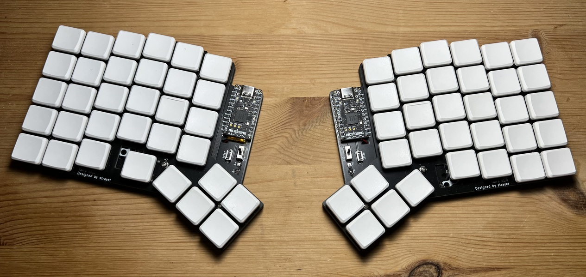

# Taira Keyboard

## What?

A wireless low-profile split mechanical keyboard with 66 keys inspired by the
ErgoDash and Corne Chocolate. It runs ZMK on two nice!nanos, is fully wireless
via Bluetooth and uses Kailh Choc V1 switches in a 18x19mm grid layout.

## Why?

I used an ErgoDash with MX switches for over a year multiple hours each day.
Even though I love typing on it, it always felt too bulky and the wires really
started to annoy me - especially when moving between workplaces. At some point I
discovered ZMK and started plans on building a keyboard based on the ErgoDash,
but as low-profile as I could manage.

After investigating which other low-profile keyboards exist in the community, I
quickly realized that the most sophisticated offer seems to be the Corne
Chocolate. This keyboard is heavily based upon the footprints of the Corne
Chocolate, but layed out in a layout very similar to the original ErgoDash.

## Build guide

Follow the [build guide](BUILDGUIDE.md) if you are interested in building your
own Taira.

## Firmware

The ZMK firmware is managed in a separate repository: [strayer/taira-keyboard-zmk-config]

[strayer/taira-keyboard-zmk-config]: https://github.com/strayer/taira-keyboard-zmk-config

## Acknowledgements

Thanks to [@omkbd](https://github.com/omkbd) and
[@foostan](https://github.com/foostan/) for releasing both the ErgoDash and the
Corne Chocolate under the MIT license. Without their work, this keyboard would
not exist.

- https://github.com/omkbd/ErgoDash
- https://github.com/foostan/crkbd/tree/main/corne-chocolate
- an unnamed coworker who helped me _a lot_ while planning and working on the
  keyboard

## Copyright

Copyright 2022 Sven Grunewaldt

License: [MIT](LICENSE)
